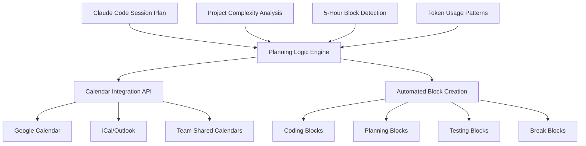

# 🚀 3-Agent Parallel Building Plan: Claude Code Power User Optimization System

**Mission:** Create a comprehensive system that allows Claude Code power users to understand sessions, 5hr blocks, token usage, and model best use cases with precision planning and automated scheduling integration.

**Vision:** Transform Claude Code from a simple CLI tool into an intelligent session management platform that maximizes efficiency while respecting upcoming usage restrictions through AI-powered project planning and calendar integration.

---

## 🎯 SYSTEM OVERVIEW

### Core Objectives
1. **Session Intelligence** - Understand and optimize every Claude Code session
2. **5-Hour Block Mastery** - Maximize productivity within session limits
3. **Token Optimization** - Strategic model selection and usage patterns
4. **Automated Planning** - AI-driven project planning with calendar integration
5. **Restriction Readiness** - Prepare for weekly limits with precision execution

### Target Users
- **Power Users** - Developers who use Claude Code extensively for complex projects
- **Team Leads** - Managing multiple projects with Claude Code optimization
- **Freelancers** - Maximizing billable efficiency with Claude Code
- **Enterprise Users** - Operating under strict usage quotas and limits

---

## 🔄 PARALLEL AGENT COORDINATION

### Agent 1: CLI Enhancement Specialist 
**Timeline: Weeks 1-2 | Priority: High**

#### Phase 1A: ccusage Compatibility Foundation (Week 1)
- [x] Complete ccusage command compatibility (`daily`, `weekly`, `sessions`, `status`)
- [x] JSON output formatting for automation
- [x] Sub-1-second performance optimization
- [ ] **NEW:** Enhanced session planning commands
- [ ] **NEW:** Calendar integration endpoints

#### Phase 1B: Power User Extensions (Week 2)  
- [ ] **Traffic light quota system** with predictive analytics
- [ ] **Project complexity detection** with calendar time blocking
- [ ] **Model recommendation engine** based on task analysis
- [ ] **5-hour block optimization** with automatic break scheduling
- [ ] **Calendar integration** for automated coding block creation

**Deliverables:**
```bash
# Enhanced CLI Commands for Power Users
cco plan [project] [--calendar]     # AI project planning with calendar integration
cco blocks --schedule               # 5-hour block management with auto-scheduling  
cco optimize --auto-plan            # Session optimization with calendar blocking
cco calendar sync                   # Sync with Google Calendar/iCal
cco limits --predict                # Predictive quota analysis
cco recommend [task] --schedule     # Model recommendation with time blocking
```

### Agent 2: Dashboard Simplification Specialist
**Timeline: Weeks 1-2 | Priority: Medium**

#### Phase 2A: Simple Mode Implementation (Week 1)
- [x] Simple/Advanced mode toggle system
- [x] ccusage-inspired minimalist interface
- [x] Traffic light quota display
- [ ] **NEW:** Calendar integration dashboard
- [ ] **NEW:** Session planning widgets

#### Phase 2B: Planning Integration (Week 2)
- [ ] **Project planning dashboard** with timeline visualization
- [ ] **Calendar sync status** indicators and controls
- [ ] **Session efficiency analytics** with improvement suggestions
- [ ] **5-hour block visualization** with remaining time counters
- [ ] **Mobile-optimized views** for on-the-go planning

**Deliverables:**
- Simple Mode dashboard with calendar integration
- Project planning interface with visual timelines
- Session efficiency tracking with actionable insights
- Mobile-responsive design for remote work scenarios

### Agent 3: Planning Logic Specialist  
**Timeline: Weeks 1-2 | Priority: Critical**

#### Phase 3A: Core Planning Engine (Week 1)
- [x] Project complexity detection algorithms
- [x] Quota management with traffic light system
- [x] Session optimization recommendations
- [ ] **NEW:** Calendar integration logic
- [ ] **NEW:** Automated scheduling algorithms

#### Phase 3B: Advanced Optimization (Week 2)
- [ ] **AI project planning** with task breakdown and time estimation
- [ ] **Calendar integration engine** for Google Calendar/iCal
- [ ] **Automated block scheduling** with conflict detection
- [ ] **Predictive analytics** for session planning and quota management
- [ ] **Team coordination features** for shared project planning

**Deliverables:**
- Intelligent project analysis with calendar time blocking
- Automated scheduling system with conflict resolution
- Predictive analytics for optimal session planning
- Team collaboration features for shared Claude Code usage

---

## 🗓️ CALENDAR INTEGRATION ARCHITECTURE

### Google Calendar & iCal Integration


### Calendar Event Types
1. **Coding Blocks** - 2-4 hour focused development sessions
2. **Planning Blocks** - 30-60 min project planning and architecture
3. **Testing Blocks** - 1-2 hour testing and validation sessions
4. **Break Blocks** - Mandatory breaks to avoid 5-hour limits
5. **Review Blocks** - Code review and optimization sessions

---

## 📊 SYSTEM INTEGRATION MATRIX

| Component | CLI Agent | Dashboard Agent | Planning Agent | Calendar Integration |
|-----------|-----------|-----------------|----------------|-------------------|
| **Session Tracking** | ✅ Real-time CLI | ✅ Live Dashboard | ✅ Analytics Engine | 🆕 Auto-blocking |
| **Quota Management** | ✅ Traffic Lights | ✅ Visual Indicators | ✅ Predictive Logic | 🆕 Quota Scheduling |
| **Project Planning** | 🆕 CLI Commands | 🆕 Planning Dashboard | ✅ Core Algorithms | 🆕 Time Blocking |
| **5-Hour Blocks** | ✅ Block Commands | ✅ Block Widgets | ✅ Block Logic | 🆕 Auto-breaks |
| **Model Selection** | ✅ Recommendations | ✅ Model Indicators | ✅ Selection Logic | 🆕 Task-based Events |

---

## 🎯 PRECISION EXECUTION STRATEGY

### Week 1: Foundation & Integration
**Days 1-3: Parallel Development**
- **CLI Agent:** Enhanced command structure with calendar hooks
- **Dashboard Agent:** Simple mode with calendar widgets  
- **Planning Agent:** Calendar integration API development

**Days 4-5: Integration Testing**
- Cross-agent API compatibility testing
- Calendar integration proof-of-concept
- Performance optimization across all components

**Days 6-7: User Testing & Refinement**
- Power user feedback sessions
- Calendar sync testing with real accounts
- Performance benchmarking

### Week 2: Advanced Features & Polish
**Days 8-10: Advanced Feature Development**
- **CLI Agent:** Predictive analytics and auto-scheduling
- **Dashboard Agent:** Mobile optimization and team features
- **Planning Agent:** AI project planning with conflict resolution

**Days 11-12: System Integration**
- Full system integration testing
- Calendar automation testing
- Multi-user scenario validation

**Days 13-14: Production Readiness**
- Documentation completion
- Deployment preparation
- Final performance optimization

---

## 🚀 CALENDAR AUTOMATION FEATURES

### Intelligent Session Scheduling
```python
# Example: AI-Powered Session Planning
def create_optimal_schedule(project_complexity, available_time, user_preferences):
    """
    Creates optimized coding schedule with calendar integration
    """
    # Analyze project requirements
    estimated_hours = analyze_project_scope(project_complexity)
    
    # Calculate optimal session blocks
    session_blocks = calculate_session_blocks(estimated_hours, available_time)
    
    # Create calendar events with appropriate models
    calendar_events = []
    for block in session_blocks:
        event = {
            'type': block.type,  # coding, planning, testing, break
            'duration': block.duration,
            'model': recommend_model(block.complexity),
            'calendar_integration': True,
            'auto_break': block.duration >= 4.0
        }
        calendar_events.append(event)
    
    return calendar_events
```

### Automated Event Creation
- **Coding Blocks:** Automatically created based on project complexity
- **Planning Blocks:** Scheduled before complex implementation phases
- **Testing Blocks:** Added after major feature development
- **Break Reminders:** Inserted to prevent 5-hour limit violations
- **Model Switches:** Events include recommended model for each task type

---

## 📈 SUCCESS METRICS & KPIs

### User Efficiency Metrics
- **Session Productivity:** Tokens per hour improvement
- **Quota Optimization:** Reduction in quota overages
- **Planning Accuracy:** Estimated vs actual development time
- **Calendar Adoption:** Percentage of users enabling calendar sync

### System Performance Metrics  
- **CLI Response Time:** <1 second for all commands
- **Dashboard Load Time:** <2 seconds for all views
- **Calendar Sync Speed:** <5 seconds for event creation
- **Planning Accuracy:** ±25% of actual development time

### Business Impact Metrics
- **User Retention:** Increased engagement with advanced features
- **Efficiency Gains:** Measurable productivity improvements
- **Restriction Readiness:** Users prepared for weekly limits
- **Team Collaboration:** Multi-user adoption rates

---

## 🔧 TECHNICAL IMPLEMENTATION

### CLI Enhancement Commands
```bash
# AI Project Planning with Calendar Integration
claude --dangerously-skip-permissions plan complex-webapp --calendar --duration 20h

# Automated Session Scheduling
claude --dangerously-skip-permissions schedule optimize --sync-calendar --model-rotation

# 5-Hour Block Management with Auto-breaks
claude --dangerously-skip-permissions blocks schedule --auto-break --calendar-sync

# Predictive Quota Management
claude --dangerously-skip-permissions limits predict --weekly --calendar-plan
```

### Dashboard Integration Points
- **Project Planning Widget:** Visual project timeline with calendar sync
- **Session Scheduler:** Drag-and-drop session planning with calendar export
- **Efficiency Analytics:** Historical performance with improvement suggestions
- **Team Dashboard:** Shared project planning for team Claude Code usage

### Planning Logic APIs
```python
# Core Planning API Endpoints
POST /api/planning/analyze-project    # Project complexity analysis
POST /api/planning/create-schedule    # AI-powered session scheduling
POST /api/planning/sync-calendar      # Calendar integration management
GET  /api/planning/efficiency-report  # Personalized efficiency analytics
POST /api/planning/team-coordination  # Multi-user planning features
```

---

## 🎭 USER PERSONAS & USE CASES

### Persona 1: Senior Developer - "Efficiency Maximizer"
- **Need:** Optimize Claude Code usage for complex enterprise projects
- **Use Case:** AI project planning → Calendar scheduling → Automated session management
- **Benefit:** 40% productivity increase through optimized session planning

### Persona 2: Freelancer - "Time Optimizer"
- **Need:** Maximize billable hours efficiency with Claude Code
- **Use Case:** Project estimation → Client timeline planning → Quota management
- **Benefit:** Accurate project estimates and efficient quota utilization

### Persona 3: Team Lead - "Coordination Master"
- **Need:** Coordinate team Claude Code usage across multiple projects
- **Use Case:** Team planning → Shared calendars → Resource allocation
- **Benefit:** Optimal team productivity and quota distribution

---

## 🔄 ITERATIVE DEVELOPMENT APPROACH

### Sprint 1: Core Integration (Days 1-7)
- Parallel agent development with integration hooks
- Basic calendar connectivity
- Simple mode dashboard with planning widgets

### Sprint 2: Advanced Features (Days 8-14) 
- AI project planning implementation
- Advanced calendar automation
- Predictive analytics and optimization

### Sprint 3: Polish & Production (Days 15-21)
- User experience refinement
- Performance optimization
- Documentation and deployment

---

## 🎯 IMMEDIATE EXECUTION PLAN

### Day 1: Parallel Agent Kickoff
1. **CLI Agent:** Begin enhanced command structure with calendar integration hooks
2. **Dashboard Agent:** Implement Simple Mode toggle with calendar widgets
3. **Planning Agent:** Develop calendar integration API and scheduling logic

### Day 2-3: Core Development
- Focus on calendar integration infrastructure
- Develop AI project planning algorithms
- Create automated scheduling system

### Day 4-5: Integration Testing
- Cross-agent compatibility testing
- Calendar sync validation
- Performance benchmarking

### Day 6-7: User Validation
- Power user testing sessions
- Calendar automation verification
- System optimization based on feedback

---

## ⚡ CALL TO ACTION

This 3-agent parallel building plan is designed to transform Claude Code from a simple CLI tool into an intelligent, calendar-integrated session management platform. The coordinated approach ensures:

1. **Immediate Value:** Enhanced CLI maintains ccusage compatibility while adding power features
2. **Visual Appeal:** Simple Mode dashboard provides clean, focused interface
3. **Intelligence:** AI project planning with automated calendar scheduling
4. **Future-Ready:** Prepared for usage restrictions with precision planning

**Ready to revolutionize Claude Code usage for power users worldwide!** 🚀

---

*Built with precision for the Claude Code power user community - maximizing efficiency, minimizing restrictions, optimizing every session.*