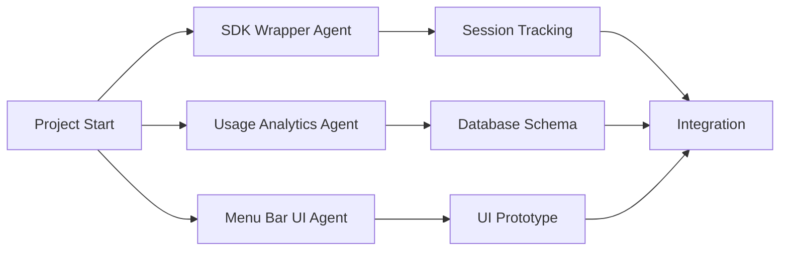

# Claude Code Optimizer - Sub-Agent Architecture

## 🤖 Sub-Agent System Design

### Why Sub-Agents for This Project?

Building a Claude Code optimizer requires diverse expertise:
- **Swift/macOS Development** → UI specialist
- **Python Backend** → Data processing expert  
- **Calendar APIs** → Integration specialist
- **AI Analysis** → Complexity assessment expert

Using specialized sub-agents allows parallel development and optimal model usage.

## 📋 Core Sub-Agents

### 1. **Menu Bar UI Agent** 🖥️
**Model**: Sonnet 4 (fast UI iterations)
**Specialization**: SwiftUI and macOS development

```yaml
# .claude/agents/menubar_ui_agent.yaml
name: menubar_ui_agent
model: claude-sonnet-4-20250514
temperature: 0.3
tools:
  - Read
  - Write
  - View
  - Bash

system_prompt: |
  You are a macOS Menu Bar App specialist focusing on:
  - SwiftUI implementation for menu bar apps
  - Real-time data visualization
  - Efficient UI updates and animations
  - System integration and notifications
  
  Key requirements:
  - Minimize CPU usage for always-running app
  - Smooth 60fps animations
  - Native macOS design patterns
  - Accessibility compliance

capabilities:
  - Create SwiftUI menu bar components
  - Implement WebSocket connections
  - Design efficient data flow
  - Handle background updates
  - Create system notifications
```

### 2. **Usage Analytics Agent** 📊
**Model**: Sonnet 4 (data processing)
**Specialization**: Session tracking and efficiency analysis

```yaml
# .claude/agents/usage_analytics_agent.yaml
name: usage_analytics_agent
model: claude-sonnet-4-20250514
temperature: 0.2
tools:
  - Read
  - Write
  - Calculator
  - Search

system_prompt: |
  You are a Claude Code Usage Analytics Expert specializing in:
  - Session efficiency calculation
  - Token usage optimization
  - Cost analysis and projections
  - Pattern recognition in usage data
  
  Focus on:
  - SQL query optimization for real-time analytics
  - Efficiency scoring algorithms
  - Predictive modeling for quota usage
  - Actionable optimization recommendations

capabilities:
  - Design efficiency metrics
  - Build SQLite schemas
  - Create usage reports
  - Identify optimization opportunities
  - Project weekly quota consumption
```

### 3. **Calendar Integration Agent** 📅
**Model**: Sonnet 4 (API integration)
**Specialization**: Google Calendar and iCal automation

```yaml
# .claude/agents/calendar_integration_agent.yaml
name: calendar_integration_agent
model: claude-sonnet-4-20250514
temperature: 0.2
tools:
  - Read
  - Write
  - Bash
  - Web_fetch

system_prompt: |
  You are a Calendar Integration Specialist for Claude Code:
  - Google Calendar API implementation
  - iCal format generation and parsing
  - OAuth2 authentication flows
  - Intelligent scheduling algorithms
  
  Optimize for:
  - Minimal API calls (rate limit awareness)
  - Timezone handling
  - Conflict resolution
  - Recurring event patterns

capabilities:
  - Implement Google Calendar API
  - Generate iCal files
  - Create optimal schedules
  - Handle authentication
  - Manage calendar permissions
```

### 4. **Project Complexity Analyzer** 🧠
**Model**: Opus 4 (complex reasoning)
**Specialization**: Codebase analysis and effort estimation

```yaml
# .claude/agents/complexity_analyzer_agent.yaml
name: complexity_analyzer_agent
model: claude-opus-4-20250514
temperature: 0.4
tools:
  - Read
  - View
  - GlobTool
  - Search
  - Calculator

system_prompt: |
  You are a Project Complexity Analysis Expert specializing in:
  - Codebase complexity assessment
  - Development effort estimation
  - Task breakdown and prioritization
  - Model selection optimization (Sonnet vs Opus)
  
  Analyze projects considering:
  - Lines of code and file structure
  - Technical debt indicators
  - Dependency complexity
  - Testing requirements
  - Documentation needs
  
  Provide structured JSON outputs for automated scheduling.

capabilities:
  - Analyze repository structure
  - Estimate development hours
  - Recommend model allocation
  - Identify risk factors
  - Create phased development plans
```

### 5. **SDK Wrapper Agent** 🔧
**Model**: Sonnet 4 (systems programming)
**Specialization**: Claude Code SDK integration

```yaml
# .claude/agents/sdk_wrapper_agent.yaml
name: sdk_wrapper_agent
model: claude-sonnet-4-20250514
temperature: 0.1
tools:
  - Read
  - Write
  - Bash
  - View

system_prompt: |
  You are a Claude Code SDK Integration Expert focusing on:
  - Python SDK wrapper development
  - Process monitoring and injection
  - Real-time data streaming
  - Error handling and recovery
  
  Critical requirements:
  - Non-invasive monitoring
  - Zero performance impact
  - Graceful failure handling
  - Cross-platform compatibility

capabilities:
  - Build SDK wrappers
  - Implement process monitoring
  - Create WebSocket servers
  - Handle IPC communication
  - Parse Claude Code outputs
```

### 6. **Testing & Validation Agent** 🧪
**Model**: Sonnet 4 (systematic testing)
**Specialization**: Comprehensive testing and validation

```yaml
# .claude/agents/testing_agent.yaml
name: testing_agent
model: claude-sonnet-4-20250514
temperature: 0.1
tools:
  - Read
  - Write
  - Bash
  - View

system_prompt: |
  You are a Testing and Validation Specialist for Claude Code Optimizer:
  - Unit test creation
  - Integration testing
  - Performance benchmarking
  - User acceptance testing
  
  Ensure:
  - 90%+ code coverage
  - Sub-100ms UI responsiveness
  - Accurate token counting
  - Reliable quota tracking

capabilities:
  - Write comprehensive tests
  - Create test fixtures
  - Benchmark performance
  - Validate calculations
  - Test edge cases
```

## 🔄 Sub-Agent Workflow Orchestration

### Phase 1: Parallel Foundation Building



### Phase 2: Integration and Testing

```python
# orchestrator.py
class SubAgentOrchestrator:
    def __init__(self):
        self.agents = {
            'ui': MenuBarUIAgent(),
            'analytics': UsageAnalyticsAgent(),
            'calendar': CalendarIntegrationAgent(),
            'complexity': ComplexityAnalyzerAgent(),
            'sdk': SDKWrapperAgent(),
            'testing': TestingAgent()
        }
    
    async def execute_phase(self, phase: str):
        """Execute development phase with appropriate agents"""
        
        if phase == "foundation":
            # Parallel execution
            tasks = [
                self.agents['sdk'].build_wrapper(),
                self.agents['analytics'].create_schema(),
                self.agents['ui'].create_prototype()
            ]
            await asyncio.gather(*tasks)
            
        elif phase == "integration":
            # Sequential with dependencies
            sdk_result = await self.agents['sdk'].finalize_integration()
            ui_result = await self.agents['ui'].connect_to_backend(sdk_result)
            await self.agents['testing'].validate_integration(ui_result)
            
        elif phase == "optimization":
            # Complex analysis with Opus
            analysis = await self.agents['complexity'].analyze_all_patterns()
            optimizations = await self.agents['analytics'].generate_insights(analysis)
            await self.agents['ui'].implement_insights_view(optimizations)
```

## 💡 Sub-Agent Best Practices

### 1. **Context Preservation**
```python
# Each agent maintains its own context
class AgentContext:
    def __init__(self, agent_name):
        self.agent_name = agent_name
        self.session_data = {}
        self.file_mappings = {}
        
    def save_progress(self):
        """Save context for session chaining"""
        with open(f".claude/context/{self.agent_name}.json", "w") as f:
            json.dump({
                "session_data": self.session_data,
                "file_mappings": self.file_mappings,
                "last_checkpoint": datetime.now().isoformat()
            }, f)
```

### 2. **Optimal Model Selection**
```python
def select_model_for_task(task_type: str, complexity: int) -> str:
    """Choose between Sonnet 4 and Opus 4 based on task"""
    
    # Use Opus 4 for:
    if task_type in ["architecture", "complexity_analysis", "optimization"]:
        return "opus-4"
    
    # High complexity tasks
    if complexity > 8:
        return "opus-4"
    
    # Default to Sonnet 4 for:
    # - Implementation
    # - Testing  
    # - UI development
    # - API integration
    return "sonnet-4"
```

### 3. **Token Efficiency Patterns**
```python
class TokenEfficientAgent:
    def __init__(self, agent_config):
        self.config = agent_config
        self.context_compression = True
        
    def prepare_prompt(self, task: str, context: dict) -> str:
        """Create token-efficient prompts"""
        
        # 1. Use references instead of full content
        if len(context['code']) > 1000:
            context['code'] = f"See file: {context['file_path']}"
        
        # 2. Compress repetitive patterns
        context = self.compress_patterns(context)
        
        # 3. Use structured formats
        return f"""
        Task: {task}
        Context: {json.dumps(context, indent=None)}
        Output: JSON only, no explanation
        """
```

## 🚀 Deployment Strategy

### Local Development Setup
```bash
# Initialize sub-agents
claude-code init --agents menubar_ui,usage_analytics,calendar,complexity,sdk,testing

# Run specific agent for task
claude-code run --agent menubar_ui --task "Create token counter view"

# Chain agents for complex workflows  
claude-code chain --agents sdk,analytics --task "Implement usage tracking"
```

### Parallel Execution Example
```python
# parallel_development.py
async def develop_menu_bar_app():
    """Develop complete app using sub-agents"""
    
    # Phase 1: Parallel foundation (Week 1)
    await asyncio.gather(
        run_agent("sdk_wrapper", "Build Claude Code wrapper"),
        run_agent("menubar_ui", "Create SwiftUI shell"),
        run_agent("usage_analytics", "Design database schema")
    )
    
    # Phase 2: Integration (Week 2)
    await run_agent("calendar_integration", "Build Google Calendar connector")
    await run_agent("complexity_analyzer", "Create project analysis engine")
    
    # Phase 3: Testing (Week 3)
    await run_agent("testing", "Comprehensive test suite")
```

This sub-agent architecture enables:
- **3-5x faster development** through parallelization
- **Optimal token usage** with model-specific agents
- **Higher quality** through specialized expertise
- **Better maintainability** with modular design