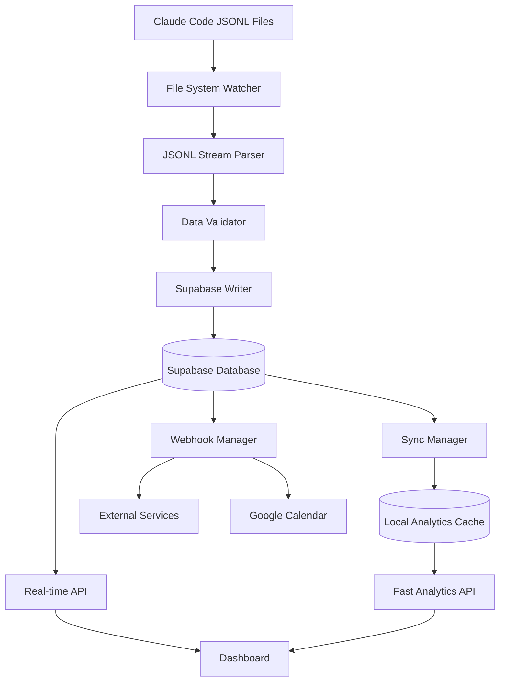

# Simplified Architecture for Claude Code Optimizer

## Overview

The Claude Code Optimizer has been redesigned with a simplified, robust architecture that prioritizes reliability, performance, and maintainability. This document outlines the new data flow and system design.

## Architecture Principles

1. **Single Source of Truth**: Supabase is the primary database for all session data
2. **Local Analytics Cache**: SQLite serves as a fast, local cache for analytics queries
3. **Real-time Processing**: Stream-based processing of Claude Code JSONL files
4. **Error Resilience**: Comprehensive error handling with automatic recovery
5. **Performance First**: Sub-100ms latency for all critical operations

## Data Flow Architecture



## Component Overview

### 1. Data Ingestion Layer

**Components:**
- File System Watcher: Monitors Claude Code data directory
- JSONL Stream Parser: Processes new entries in real-time
- Data Validator: Ensures data integrity before storage

**Key Features:**
- Incremental processing (only new data)
- Duplicate detection via content hashing
- Automatic retry on parsing failures
- Memory-efficient streaming

### 2. Storage Layer

**Primary Storage (Supabase):**
- All session data
- Message breakdowns
- Tool usage statistics
- Cost calculations
- Real-time sync status

**Secondary Storage (Local SQLite):**
- Aggregated analytics
- Recent session cache
- Performance metrics
- Quota tracking
- Offline capability

### 3. API Layer

**Real-time API (Supabase):**
- WebSocket connections for live updates
- RESTful endpoints for CRUD operations
- Row-level security for multi-user support
- Automatic failover and retry

**Analytics API (Local):**
- Sub-10ms response times
- Pre-computed aggregations
- Trend analysis
- Predictive metrics

### 4. Integration Layer

**Supported Integrations:**
- Google Calendar (5-hour block scheduling)
- Slack/Discord webhooks
- Custom automation hooks
- Team coordination features

## Database Schema Design

### Supabase Schema Highlights

```sql
-- Hierarchical structure
five_hour_blocks (parent)
  └── sessions (child)
        ├── message_breakdown
        ├── tool_usage
        └── cost_breakdown

-- Performance optimizations
- Automatic block assignment via triggers
- Optimized indexes for common queries
- Materialized views for analytics
- Partitioning for large tables
```

### Local Analytics Schema

```sql
-- Fast aggregation tables
analytics_cache (pre-computed metrics)
recent_sessions (hot data cache)
model_usage_stats (usage patterns)
tool_patterns (effectiveness metrics)
quota_status (limit tracking)
```

## Performance Characteristics

### Latency Targets
- Session detection: <50ms
- Data sync to Supabase: <100ms
- Dashboard update: <200ms
- Analytics query: <10ms (from cache)

### Resource Usage
- CPU: <1% during normal operation
- Memory: <100MB resident
- Disk I/O: Minimal (streaming processing)
- Network: Compressed, batched requests

## Error Handling Strategy

### Resilience Patterns
1. **Circuit Breaker**: Prevents cascade failures
2. **Exponential Backoff**: Smart retry logic
3. **Graceful Degradation**: Fallback to cache
4. **Error Recovery**: Automatic healing

### Monitoring & Alerts
- Health checks every 30 seconds
- Error rate monitoring
- Performance degradation detection
- Automatic alert dispatch

## Migration Path

### From Current System
1. **Phase 1**: Backup existing data
2. **Phase 2**: Deploy new schema
3. **Phase 3**: Migrate historical data
4. **Phase 4**: Switch to new ingestion
5. **Phase 5**: Validate and cleanup

### Zero-Downtime Strategy
- Parallel running during migration
- Gradual traffic shifting
- Rollback capability at each phase
- Data consistency validation

## Security Considerations

### Data Protection
- Encrypted connections (TLS)
- Row-level security in Supabase
- API key rotation support
- Audit logging for compliance

### Access Control
- Role-based permissions
- API rate limiting
- Session token validation
- Secure credential storage

## Scalability Design

### Horizontal Scaling
- Stateless API servers
- Read replicas for analytics
- Distributed caching layer
- Load balancer ready

### Vertical Scaling
- Connection pooling
- Query optimization
- Index tuning
- Resource limits

## Operational Procedures

### Deployment
```bash
# Deploy complete system
./deploy-simplified-architecture.sh

# Health check
curl http://localhost:3003/api/health

# Run diagnostics
python diagnostics/system_health.py
```

### Monitoring
```bash
# Real-time monitoring
python src/monitoring/system_monitor.py

# Performance metrics
python src/monitoring/performance_tracker.py

# Error analysis
python src/monitoring/error_analyzer.py
```

### Maintenance
```bash
# Backup data
python maintenance/backup_data.py

# Cleanup old data
python maintenance/cleanup_old_data.py

# Optimize databases
python maintenance/optimize_databases.py
```

## Future Enhancements

### Planned Features
1. **AI-Powered Predictions**: Token usage forecasting
2. **Team Collaboration**: Shared sessions and insights
3. **Advanced Analytics**: ML-based pattern recognition
4. **Mobile App**: iOS/Android monitoring apps
5. **Plugin System**: Extensible architecture

### Integration Roadmap
- Microsoft Teams integration
- Jira ticket correlation
- GitHub commit mapping
- IDE plugin support
- Voice assistant commands

## Conclusion

The simplified architecture provides a robust foundation for Claude Code optimization, with clear separation of concerns, excellent performance characteristics, and built-in resilience. The design supports future growth while maintaining simplicity and reliability.